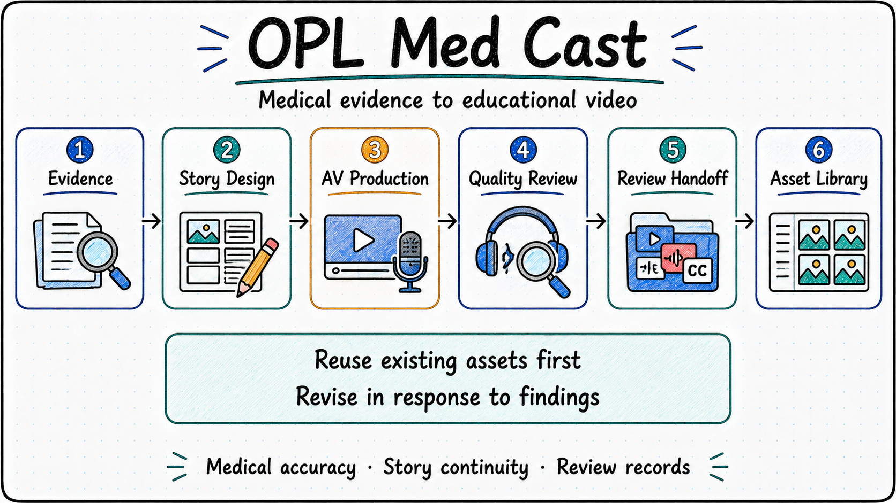

<p align="center">
  
</p>

<p align="center">
  <a href="./README.md"><strong>English</strong></a> | <a href="./README.zh-CN.md">中文</a>
</p>

# OPL Med Cast

Explain the medical evidence. Make the video work.

OPL Med Cast is an OPL agent for medical education videos. It helps clinicians and content creators plan a series, develop its stories, organize audiovisual production, review the results, and prepare files for review. Inspected keyframes worth reusing become a reference library for future work.

It follows the organization of OPL Book Forge: the domain agent provides professional methods, while OPL Framework handles shared execution and stage management. The formal name is **OPL Med Cast**; the repository, agent, and package share the technical identifier `opl-medcast`.

<p align="center">
  
</p>

## Start A Video

Describe the audience, what viewers should understand or do, and the sources, scripts, media, and production workspace already available. For example:

- "Plan a series for patients newly diagnosed with hypertension. Answer one common question per episode and identify the supporting medical evidence."
- "The narration for this episode is approved. Reuse existing footage, fix scenes that do not match the narration, and create only the missing shots."
- "Review the current version of this series, organize its videos, subtitles, and narration, and list anything still requiring full listening or medical review."

| Action | Scope |
| --- | --- |
| `plan-series` | Medical evidence, audience, series boundaries, and episode goals |
| `produce-episodes` | Story and shot design, media production, editing, and video review |
| `review-delivery` | Current-version review, review-package preparation, and asset curation |

These actions connect six stages and can continue from existing work. An episode revision addresses the affected material; unchanged narration reuses its audio and subtitles. See [Architecture](docs/architecture.md) for stage responsibilities.

## Make Production Experience Reusable

**Let the visuals explain the narration.** Design speech and visible events together. Review both individual shots and the continuity of the whole story. When footage falls short, revise the narrative and shot sequence instead of padding the timeline with repeats or fragmented cuts.

**Reuse before generating.** Search the keyframe library and reviewed footage first. Organize assets by purpose and retain provenance, review records, and reuse limits. A useful still does not establish that its generated video passed review. A rejected source stays excluded even if an old usable-range field remains.

**Keep delivery status explicit.** Technical checks, visual review, continuous motion, full listening, medical review, and platform upload have separate records. A review package may contain clearly identified pending work; public release still requires the relevant review and authorization.

## Installation

Install through the standard OPL Package entry:

```bash
opl packages install opl-medcast --json
```

The primary distribution channel is `ghcr.io/gaofeng21cn/one-person-lab-packages/opl-medcast`. Versions are published independently; `latest-stable` selects the current version. OPL and the native plugin manager handle installation and updates. See the [installation guide](docs/installation.md) for environment requirements.

## Use A Local Workspace

The current version includes a [primary Skill](agent/primary_skill/SKILL.md), six [professional Skills](agent/professional_skills/), and three read-only helper commands. Original media, narration, configuration profiles, and publication folders stay in the production workspace. Generation, editing, and packaging use that workspace's verified tools.

Run the following commands from this repository, replacing the example path with the actual production workspace. Python 3.10 or later and PyYAML are required.

```bash
# Inspect workspace configuration and file locations
python3 runtime/native_helpers/medcast.py inspect --workspace /absolute/medical-workspace

# Find keyframes in the clinical consultation category
python3 runtime/native_helpers/medcast.py assets --workspace /absolute/medical-workspace --category 05
```

The `preflight` command checks the current production manifest, selected episodes, master files, source ranges, and review records. See [Workspace integration](docs/workspace-adapter.md) for input formats and a complete example. These helpers neither start media generation nor replace medical or audiovisual judgment.

## Status And Verification

**The current version follows the standard OPL Package publication path through OCI.** OPL structure and generated-interface checks passed, along with 14 behavioral tests. Read-only integration was verified against five existing series and 72 keyframes.

The OPL Meta Agent engineering request was blocked before launch by an installed identity mismatch. It has not produced a blueprint or completed independent qualification. Repository structure and helper checks do not substitute for that work. See [Build status](docs/status.md) for the failure, saved request, and recovery conditions.

Read [AGENTS.md](AGENTS.md) before editing.

| Command | Checks |
| --- | --- |
| `scripts/verify.sh fast` | Behavioral tests, professional Skill references, and bundled-file consistency |
| `scripts/verify.sh full` | The fast checks plus OPL structure, source hygiene, and helper resolution |

Full verification requires a compatible OPL Framework. The script uses `opl` from the environment by default; set `OPL_BIN` to use another location. The verification environment and evidence are recorded in the [build readback](docs/evidence/local-build-readback.json).

## Further Reading

- [Medical video production](docs/production-sop.md)
- [Media backends and generation tasks](docs/backend-sop.md)
- [Audiovisual review](docs/visual-review-sop.md) and [review handoff](docs/delivery-sop.md)
- [Keyframe library](docs/keyframe-library.md) and [interruption recovery](docs/recovery-sop.md)
- [Architecture and responsibilities](docs/architecture.md), [interface contracts](contracts/), and [method provenance](docs/provenance.md)

Supporting documents are currently in Chinese.
