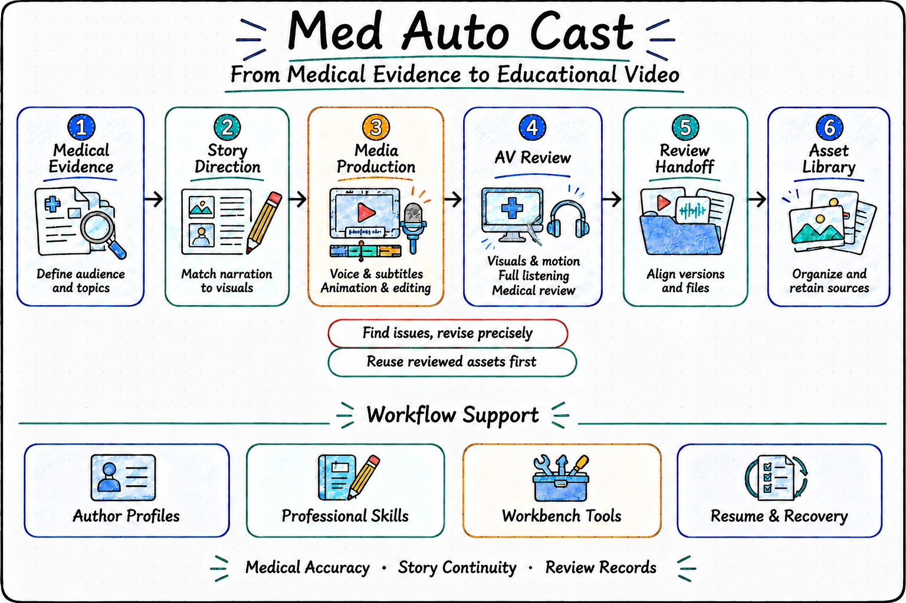

<p align="center">
  
</p>

<p align="center">
  <a href="./README.md"><strong>English</strong></a> | <a href="./README.zh-CN.md">中文</a>
</p>

# Med Auto Cast

**Explain the medical evidence. Make the video work.**

Med Auto Cast is a medical education video agent for clinicians, health educators, and medical content creators. Starting with a question patients care about, it helps you review the evidence, plan a series, write narration, design visuals, produce voiceovers and animation, edit and review videos, and prepare accompanying copy.

Start with a topic or continue from an existing script, recording, asset collection, or video. Refine one episode, produce a series, or update earlier work while building on what you already have.

<p align="center">
  
</p>

## What You Can Do

| Your goal | How Med Auto Cast helps |
| --- | --- |
| Turn medical knowledge into topics patients can understand | Review evidence, common patient questions, and the limits of what can be said; develop series themes, episode goals, and outlines |
| Tell a coherent story | Write narration and storyboards, connect each visual to the explanation, and maintain continuity between shots |
| Produce a video from a script | Coordinate voiceovers, subtitles, animation, and editing; add branding and background music to create a video for review |
| Identify what needs revision | Check visual meaning, framing, and motion continuity; organize listening feedback and medical review findings |
| Prepare an episode or series for handoff | Gather videos, subtitles, narration, review records, and accompanying copy for Xiaohongshu and WeChat Channels |
| Build a useful collection for future work | Organize reviewed keyframes and reusable clips with their sources and usage limits, and look for existing assets before creating more |

## Start With A Request

Describe the audience, what viewers should understand, and the material you already have. For example:

> "Plan an educational series for patients newly diagnosed with hypertension. Answer one common question per episode and identify the medical evidence. Start with the topics and narration for episode one."

> "The narration for this episode is approved. Reuse existing footage, fix scenes that do not match the explanation, and create only the missing shots."

> "Organize the current videos, subtitles, and publication copy for this series. List anything still requiring full listening or medical review, then add worthwhile keyframes to the asset library."

For an existing project, provide its folder and identify the current version, what has been approved, and what you want to change.

## Build On Your Previous Work

**Keep your own style.** Reuse your author information, authorized voice, branding, and presentation preferences to maintain a consistent voice and visual style across a series.

**Make focused revisions.** Reuse audio and subtitles when the narration is unchanged, and focus visual revisions on the affected shots. Updating one episode preserves the others.

**Continue after an interruption.** Use existing files and production records to establish progress, resume unfinished work, and retain earlier versions for reference.

**Know what you are receiving.** Videos, accompanying copy, revision notes, and pending reviews are organized together. You can see which version you have, what has been checked, and whose confirmation is still needed. Medical content receives final confirmation from a qualified professional; platform uploads require your authorization.

## Install And Get Started

Install through OPL:

```bash
opl packages install med-autocast --json
```

Start a new task after installation and tell Med Auto Cast what you want to create. Before producing your first video, configure the required voice and video generation services using the [setup guide](docs/installation.md). Use the [project setup guide](docs/workspace-adapter.md) to continue an existing production project.

## Learn More

- [Production workflow](docs/production-sop.md): from topics and scripts to video handoff.
- [Audiovisual review](docs/visual-review-sop.md) and [delivery guide](docs/delivery-sop.md): review, revise, and organize the results.
- [Keyframe library](docs/keyframe-library.md): collect and reuse valuable visuals.
- [Current capabilities and validation](docs/status.md): what has been verified and which evaluations remain outstanding.

For development and maintenance, see [AGENTS.md](AGENTS.md), [Project](docs/project.md),
[Architecture](docs/architecture.md), [Invariants](docs/invariants.md) and
[Decisions](docs/decisions.md). Backend operations and source attribution are in
[Backend SOP](docs/backend-sop.md) and [Provenance](docs/provenance.md).
Supporting guides are currently in Chinese.

## License

Apache License 2.0. See [LICENSE](LICENSE). Copyright 2026 FengGao Lab
contributors.
