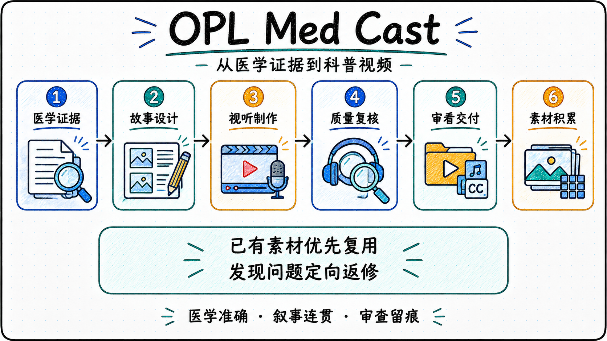

<p align="center">
  
</p>

<p align="center">
  <a href="./README.md">English</a> | <a href="./README.zh-CN.md"><strong>中文</strong></a>
</p>

# OPL Med Cast

把医学证据讲清楚，把科普视频做好。

OPL Med Cast 是面向医学科普视频的 OPL 智能体，帮助医生和内容创作者规划系列、编写故事、组织视听制作、复核成片，并整理可供审看的交付文件。经过审查、值得复用的关键帧会归入素材库，为后续创作提供参考。

它沿用 OPL Book Forge 的组织方式：专业方法由领域智能体提供，通用执行与阶段管理由 OPL Framework 负责。正式名称为 **OPL Med Cast**，仓库、智能体和软件包统一使用技术标识 `opl-medcast`。

<p align="center">
  
</p>

## 开始制作视频

说明准备讲给谁听、希望观众理解什么或采取什么行动，再提供已有资料、脚本、素材和制作工作区。例如：

- “面向刚确诊高血压的患者规划一个系列，每集回答一个常见问题，并标明医学依据。”
- “这集配音已经确认，请复用现有素材，修正画面与旁白不对应的部分，只补充缺少的镜头。”
- “复核这一季的当前版本，整理视频、字幕和配音，列出仍需完整听审或医学复核的项目。”

| 入口 | 处理的工作 |
| --- | --- |
| `plan-series` | 核对医学证据，确定受众、系列范围和单集目标 |
| `produce-episodes` | 设计故事与镜头，组织媒体制作、剪辑和成片复核 |
| `review-delivery` | 复核当前版本，整理审看文件，沉淀关键帧与制作经验 |

三个入口串联六个工作阶段，也允许从已有成果继续。修改一集时，只处理受影响的内容；旁白没有变化，就复用原配音和字幕。阶段划分与职责见[架构说明](docs/architecture.md)。

## 让制作经验持续发挥作用

**画面服务于讲述。** 旁白与可见事件共同设计，既要看单个镜头是否准确，也要看整篇故事是否连贯。素材不足时调整叙事和镜头安排，避免用重复画面或零碎切换凑时长。

**先复用，再补充。** 制作前查询关键帧库和已审视频片段。素材按用途分类，保留来源、审查记录和使用限制；关键帧具有参考价值，不代表它生成的视频也已通过审查。明确拒用的源片不会因残留的可用区间而重新进入时间轴。

**交付状态说清楚。** 技术检查、画面复核、连续动态、完整听审、医学复核和平台上传分别记录。审看包可以附带明确的待审项，公开发布仍需相应审查与授权。

## 安装预览版

从[版本页面](https://github.com/gaofeng21cn/opl-medcast/releases/tag/v0.1.0)下载源码与插件包，或使用 Codex CLI 安装固定版本：

```bash
codex plugin marketplace add gaofeng21cn/opl-medcast --ref v0.1.0 --json
codex plugin add opl-medcast@opl-medcast --json
```

在新任务中选择 OPL Med Cast。插件提供专业方法与随包辅助程序；OPL 托管阶段运行仍需 Framework 登记和资格验证。媒体制作还需要已配置的制作工作区及可用后端。详细环境准备和下载包用法见[安装说明](docs/installation.md)。

## 在本地工作区使用

当前版本提供[主入口技能](agent/primary_skill/SKILL.md)和六个[专业技能](agent/professional_skills/)，以及三个只读辅助命令。原始媒体、配音、配置档案和发布目录保留在制作工作区；实际生成、剪辑和打包沿用该工作区已经验证的工具。

在本仓根目录执行以下命令，将示例路径替换为实际制作工作区。运行环境需要 Python 3.10 或更新版本，并安装 PyYAML。

```bash
# 检查工作区配置与文件位置
python3 runtime/native_helpers/medcast.py inspect --workspace /absolute/medical-workspace

# 查询“门诊与治疗沟通”类别的关键帧
python3 runtime/native_helpers/medcast.py assets --workspace /absolute/medical-workspace --category 05
```

交付预检使用 `preflight` 命令，核对当前制作单、目标集数、母版文件、源片区间和审查记录。输入格式与完整示例见[工作区接入说明](docs/workspace-adapter.md)。这些辅助命令不会启动媒体生成，也不会代替医学或视听质量判断。

## 当前进展与验证

**0.1.0 为首个公开预览版本，提供源码和 Codex 插件，尚未进入 OPL 稳定软件包渠道。** OPL 标准结构与接口生成检查已通过，14 个行为测试通过；已只读接入现有的 5 个系列和 72 张关键帧。

OPL Meta Agent 的工程调用因安装身份不一致而在启动前受阻，尚未产出设计蓝图，也未完成独立资格验证。当前仓库的结构与工具检查不能代替这部分验证。具体断点、已保存的请求和后续恢复条件见[构建状态](docs/status.md)。

修改前阅读 [AGENTS.md](AGENTS.md)。验证命令如下：

| 命令 | 检查内容 |
| --- | --- |
| `scripts/verify.sh fast` | 行为测试、专业技能引用和随包文件的一致性 |
| `scripts/verify.sh full` | 上述检查，加 OPL 结构检查、源码目录检查和辅助程序定位检查 |

完整检查需要兼容的 OPL Framework。默认调用环境中的 `opl`；使用其他位置时，通过 `OPL_BIN` 指定命令路径。当前构建的验证环境和证据见[构建记录](docs/evidence/local-build-readback.json)。

## 进一步阅读

- [医学科普视频制作流程](docs/production-sop.md)
- [媒体后端与生成任务](docs/backend-sop.md)
- [视听复核](docs/visual-review-sop.md)与[审看交付](docs/delivery-sop.md)
- [关键帧资产整理](docs/keyframe-library.md)与[中断恢复](docs/recovery-sop.md)
- [架构与职责](docs/architecture.md)、[接口约定](contracts/)及[方法来源](docs/provenance.md)
